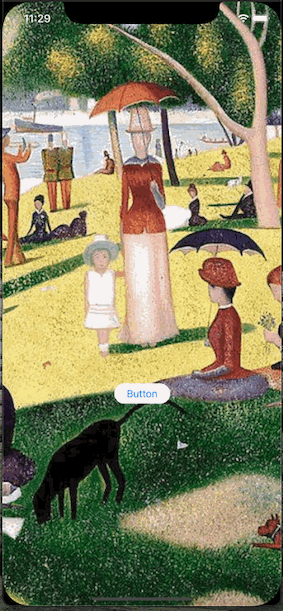

# Welcome to PasscodeLockLight

PasscodeLockLight is a lightweight version of [SwiftPasscodeLock](https://github.com/yankodimitrov/SwiftPasscodeLock). It is suitable for the apps that need to send user input back to remote databases for password validation and then handle the returned results.

It removes the local persistent password repository and password validation of SwiftPasscodeLock, enabling developers to handle user input and returned results easily.

## Features
iOS passcode lock view. Animates on wrong password.




Customisable passcode length, display title, description and image


## CocoaPods Install

Add `pod 'PasscodeLockLight'` to your Podfile. 
"PasscodeLockLight" is the name of this library.


## How to Use
### Create a default passcode lock view
```swift
let passcodeVC = PasscodeLockViewController(state: .enter)
passcodeVC.delegate = self
present(passcodeVC, animated: true, completion: nil)
```
### Create a custom passcode lock view
Create a class that conform to protocol `PasscodeLockStateType`
Example:
```swift
struct  SIMLockState: PasscodeLockStateType {
    var title: String
    var description: String
    var passcodeLength: Int
    var cancelButtonTitle: String = "Cancel"
    var deleteButtonTitle: String = "Delete"
    var isCancellableAction: Bool = true
    var isTouchIDAllowed: Bool = false
    var shouldRequestTouchIDImmediately: Bool = false
    var image: UIImage? = nil
}
```
And inject it’s object to a `PasscodeLockViewController` instance
Example:
```swift
let state =  SIMLockState(title: "Unlock PIN",
                          description: "1 attempt remaining",
                          passcodeLength: 4)
```
```swift
let passcodeVC = PasscodeLockViewController(state: state )
passcodeVC.delegate = self
present(passcodeVC, animated: true, completion: nil)
```
### Handle user input
Let your view controller conform to `PasscodeLockViewControllerDelegate`
And implement the following functions
```swift
func passcodeDidReceive(_ passcode: String, passcodeLockViewController: PasscodeLockViewController) {
// pass the passcode to your database for validation
// use passcodeLockViewController to dismiss the passcode view or animate passcode holder
}

func  passcodeLockDidDismiss(success: Bool) {
// handle the successful and failed cases of passcode unlock or Touch ID authentication
}
```
